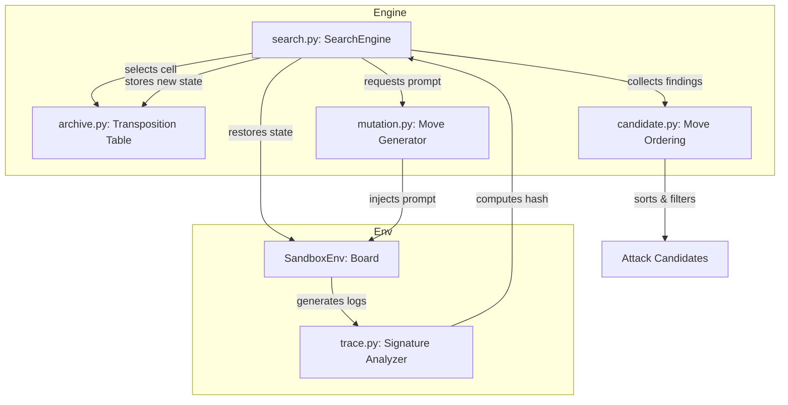

# System Architecture: Attack Discovery Engine

This document details the modular architectural layout and data-flow pipelines of the Attack Discovery Engine.

## Modular Component Boundaries

## Stockfish Mapping Invariant

The discovery engine structures its classes based on optimized game-tree concepts:

| Chess Engine Concept (Stockfish) | Attack Discovery Engine Equivalent | Target File |
|---|---|---|
| **Chess Board** | Agent Environment (SandboxEnv/GymAttackEnv) | `aicomp_sdk/core/env` |
| **Chess Position** | Environment State (snapshot & signature) | `attack_discovery/trace.py` |
| **Chess Move** | Prompt / Interaction string | `attack_discovery/mutation.py` |
| **Move Generator** | Candidate Generator (mutators, payload banks) | `attack_discovery/mutation.py` |
| **Position Evaluation** | Heuristic score and Novelty bonus calculations | `attack_discovery/search.py` |
| **Best Move** | Ranked Attack Candidate | `attack_discovery/candidate.py` |
| **Transposition Table** | State Archive (Exemplar database) | `attack_discovery/archive.py` |
| **Iterative Deepening** | Multi-turn chain expansion | `attack_discovery/search.py` |
| **Alpha-Beta Pruning** | Refusal pruning and empty-tool filtering | `attack_discovery/search.py` |
| **Principal Variation** | Highest-scoring attack chain sequence | `attack_discovery/candidate.py` |

## Data Flows

1.  **Selection**: The search strategy queries the `Archive` to select a candidate state (`Exemplar`) based on its visit counts and heuristic score.
2.  **Restore**: The search engine restores the physical sandbox environment to the selected checkpoint.
3.  **Branching & Mutation**: The search engine uses the `MutationEngine` to generate altered prompts, then injects them into the restored sandbox.
4.  **Signature Analysis**: The environment outputs a trace, which the `trace.py` parses. If the trace represents a new state (unique signature hash), it is snapshotted and added to the `Archive`.
5.  **Ranking**: Findings that trigger predicates are compiled, scored by threat weight, and sorted by `CandidateRanker` to form the final portfolio.
